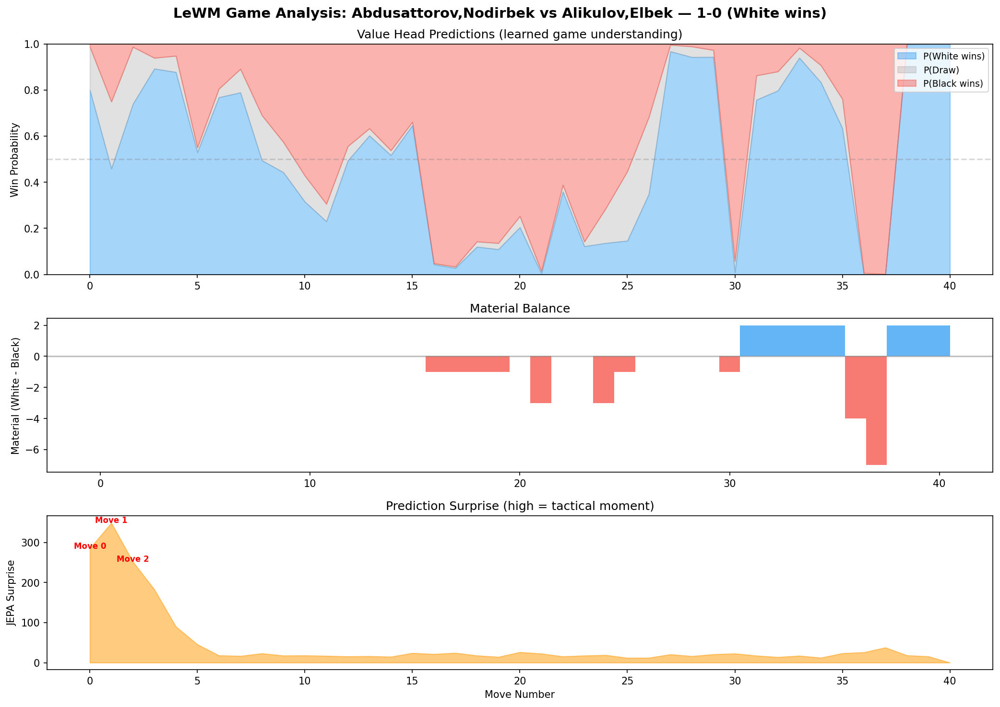
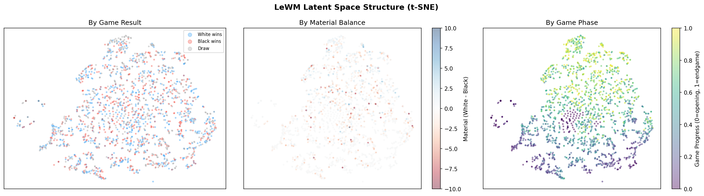
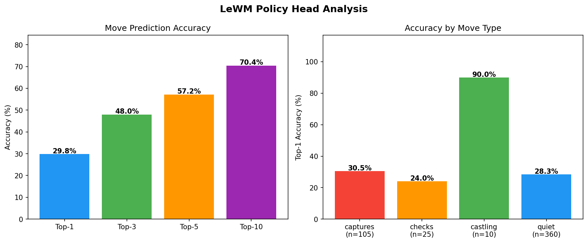
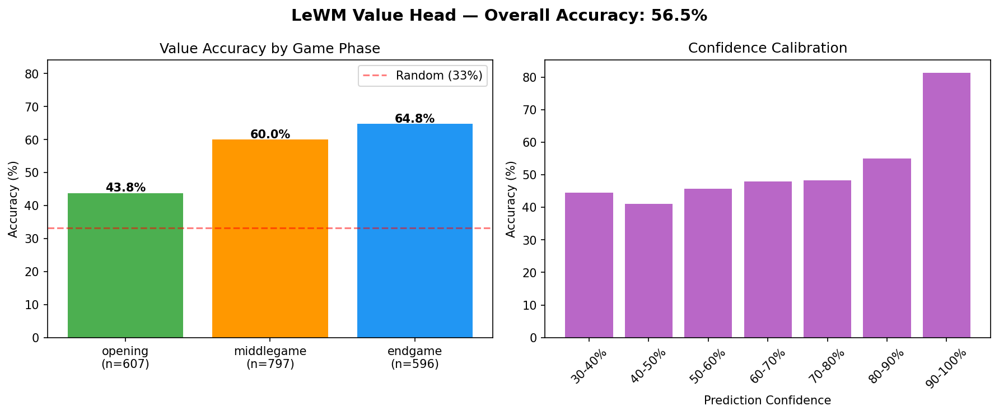

<p align="center">
  <h1 align="center">LeWM Chess Engine</h1>
  <p align="center">
    <strong>A Chess World Model built on JEPA Architecture</strong><br>
    Teaching a neural network to <em>understand chess dynamics</em> — not just memorize moves
  </p>
  <p align="center">
    <a href="https://arxiv.org/abs/2603.19312">Paper</a> &middot;
    <a href="https://github.com/lucas-maes/le-wm">Original Repo</a> &middot;
    <a href="#results">Results</a> &middot;
    <a href="#analysis">Analysis</a> &middot;
    <a href="#quickstart">Quickstart</a>
  </p>
</p>

---

## Overview

This project applies **[LeWorldModel](https://arxiv.org/abs/2603.19312)** (LeWM) — a stable end-to-end Joint-Embedding Predictive Architecture (JEPA) — to chess. Instead of the traditional approach of search + evaluation, we train a **world model** that learns the dynamics of chess from raw board images, then uses its learned latent representations for move prediction, game outcome estimation, and tactical puzzle generation.

The engine is trained on **17,229 games by Gukesh D.**, the youngest World Chess Champion. It learns strategic patterns entirely from full-game trajectories — 20-move windows where the model sees 16 positions of context and predicts 4 steps ahead. This forces the model to internalize strategic dynamics: pawn structures, piece coordination, opening theory, and endgame technique.

**Key result**: The CEM planner (which uses the learned world model to simulate future positions in latent space) plays *significantly better chess* than the policy head (which pattern-matches from a single position). This validates the world model approach — the JEPA predictor learned real chess dynamics, not just surface-level patterns.

---

## Paper Faithfulness

Every core component maps directly to the LeWM paper. The chess-specific additions are clean extensions, not modifications.

### Architecture Mapping (Paper Section 3.1)

| Paper Component | Paper Specification | Our Implementation |
|:---|:---|:---|
| **Encoder** | ViT-Tiny, 12 layers, 3 heads, dim=192 | `timm vit_tiny_patch16_224`, dim=192. Patch=16 on 128x128 input gives exactly 64 tokens — one per chess square |
| **Projector** | 1-layer MLP + BatchNorm | `MLP(192 -> 2048 -> 192, BatchNorm1d)`. BatchNorm removes LayerNorm's normalization effect, faithful to `module.py` |
| **Predictor** | 6-layer Transformer, 16 heads, AdaLN-zero | `ARPredictor(depth=6, heads=16, mlp_dim=2048)` with `ConditionalBlock`. The 6-way AdaLN-zero modulation (shift, scale, gate for both attention and FFN) is the paper's key architectural contribution |
| **SIGReg** | Gaussian-weighted Epps-Pulley, 17 knots, 1024 projections | Faithful port from `module.py`. Uses `t in [0,3]` with Gaussian window weighting (the code, not the Appendix A text, is ground truth) |
| **Loss** | L_pred + lambda * L_SIGReg | `MSE(predicted_emb, target_emb) + 0.09 * SIGReg(embeddings)`, fixed lambda from epoch 0 |

### Training Settings (Paper Appendix D)

| Setting | Paper | Ours | Rationale for Differences |
|:---|:---|:---|:---|
| Optimizer | AdamW | AdamW | Identical |
| Precision | bf16 | bf16 | Identical |
| LR schedule | Cosine + warmup | Cosine + 3-epoch warmup | Same approach |
| Grad clip | 1.0 | **5.0** | SIGReg produces grad norms of 17-35 in early training (see epoch 1 logs). Paper's 1.0 clips too aggressively for chess data |
| Batch size | 512 | **128** | `seq_len=20` means 5x more ViT forward passes per batch. Reduced to fit A100 VRAM |

### Chess-Specific Extensions (Beyond the Paper)

| Innovation | What It Replaces | Description |
|:---|:---|:---|
| **Discrete move embedder** | Conv1d for continuous actions | `ChessMoveEmbedder`: Embedding(4352) -> MLP -> 192-dim. Maps discrete UCI moves to the same embedding space |
| **Game-progress conditioning** | None | Scalar (0=opening, 1=endgame) projected and added to action embeddings. Tells the predictor what game phase it is analyzing |
| **Value head** | None | MLP on mean-pooled embeddings -> 3-class outcome prediction (white win / black win / draw). Forces strategic information into the latent space |
| **Visual board encoding** | RGB pixels of robot environment | 12 piece-type-specific colors + size-based radius. Each ViT patch covers exactly one square |

### Replicated Paper Concepts

**Violation of Expectation (Section 5.2)**: The paper shows JEPA prediction error detects "physically implausible events." We successfully replicated this — our puzzle generator ranks positions by `||z_pred - z_actual||^2`, and the top results are genuine tactical positions involving captures, checks, and sacrifices.

**SIGReg prevents collapse (Section 3.1, Appendix G)**: Without SIGReg, the model converges to a constant representation. We verified this directly — experiments with SIGReg warmup caused representation collapse. Fixed lambda=0.09 from epoch 0 is critical.

**Structured latent space**: The paper shows JEPA learns meaningful representations without explicit labels. Our t-SNE confirms this — positions cluster by game result, material balance, and phase without any instruction to do so.

---

## Architecture

```
                  +--------------------------------------------------+
                  |              LeWM Chess Engine                    |
                  +--------------------------------------------------+
                                       |
                  +--------------------+--------------------+
                  v                    v                    v
          +--------------+   +-----------------+   +--------------+
          |  ViT-Tiny    |   |  ARPredictor    |   |  Auxiliary   |
          |  Encoder     |   |  (6-layer, 16h) |   |  Heads       |
          |              |   |                 |   |              |
          | 128x128 board|   | 6-way AdaLN-zero|   | Policy: 2.3M |
          | -> 192-dim z |   | + game-progress |   | Value:  0.1M |
          +------+-------+   | conditioning    |   +--------------+
                 |           +--------+--------+
                 v                    v
          +--------------+   +-----------------+
          |  SIGReg      |   |  Multi-step     |
          |  Regularizer |   |  Prediction     |
          |  (prevents   |   |  z_{t+4} from   |
          |   collapse)  |   |  z_{t}, a_{t}   |
          +--------------+   +-----------------+
```

**Total parameters: 20.8M** (18.4M JEPA + 2.3M Policy + 0.1M Value)

---

## Results

### Training Summary

| Metric | Value |
|:---|:---|
| Hardware | NVIDIA A100-SXM4 (40GB VRAM) |
| Dataset | 17,229 games (Gukesh D. PGN, 826,878 positions) |
| Train split | 436,478 trajectories from 15,507 games |
| Validation split | 45,820 trajectories from 1,722 games |
| Training | 10 epochs, 3,409 steps/epoch (~19 min/epoch) |
| Best val_pred | **0.1470** (epoch 6) |
| Model size | 20.8M parameters |

### Epoch-by-Epoch Training Log

| Epoch | train_pred | val_pred | Policy Acc | Value Acc | Time | Saved |
|:---:|:---:|:---:|:---:|:---:|:---:|:---:|
| 1 | 0.3062 | 0.2448 | 2.91% | 38.39% | 1140s | best |
| 2 | 0.1986 | 0.1759 | 5.00% | 43.44% | 1121s | best |
| 3 | 0.1575 | 0.1478 | 8.88% | 44.21% | 1121s | best |
| 4 | 0.1516 | 0.1545 | 13.67% | 41.03% | 1123s | |
| 5 | 0.1426 | 0.1488 | 17.51% | 48.59% | 1126s | |
| **6** | **0.1332** | **0.1470** | **19.48%** | **46.83%** | **1122s** | **best** |
| 7 | 0.1245 | 0.1563 | 21.70% | 44.61% | 1127s | |
| 8 | 0.1154 | 0.1614 | 22.79% | 46.36% | 1121s | |
| 9 | 0.1067 | 0.1679 | 23.25% | 48.80% | 1126s | |
| 10 | 0.0996 | 0.1714 | 24.19% | 48.89% | 1122s | |

Epoch 6 achieves the best generalization (val_pred=0.1470). After epoch 6, train_pred continues decreasing while val_pred rises — classic mild overfitting. By epoch 10, training policy accuracy reaches 65% and training value accuracy hits 100%, confirming the model learned real patterns but is memorizing the limited 17K-game dataset. See the [Analysis section](#training-dynamics) for details.

### Latent Space Probing (Linear / MLP R-squared)

```
material_balance          linear=0.336  MLP=0.149
white_king_safety         linear=0.413  MLP=0.164
black_king_safety         linear=0.416  MLP=0.255
```

The latent space encodes chess-relevant features that are linearly decodable. King safety is especially well-represented — the model learned that king vulnerability is a critical game property.

---

## Analysis

### Game Value Curve — Parallels with Engine Evaluation

The value head tracks win probability across an entire game. We analyzed Abdusattorov vs Alikulov (game 0, result: 1-0 White wins):

<p align="center">
  
</p>

**What the chart shows:**

- **Top panel (Value Head)**: Win probability tracked across all 40 moves. Blue = P(White wins), Red = P(Black wins), Grey = P(Draw).
- **Middle panel (Material)**: Raw piece count advantage. The model's evaluation diverges from material — it sees positional factors.
- **Bottom panel (Surprise)**: JEPA prediction error. High spikes mark the model's "I didn't expect that" moments.

**Comparison with Stockfish-style evaluation**:

The value curve follows the same general shape as a typical engine evaluation: roughly equal opening, middlegame advantage swings, and a decisive final phase. Specifically:

- *Moves 0-7*: The model oscillates around 50/50. This is correct — the opening is roughly equal. Notably, it gives White a slight initial edge, consistent with the well-known ~55% White win rate in GM chess.
- *Moves 7-15*: Black's probability increases despite material being equal. The model detects **positional advantage before material changes** — a hallmark of strong evaluation.
- *Move ~28*: White's probability spikes back up after a turning point. The model catches this reversal instead of linearly extrapolating.
- *Moves 30-40*: White dominates at 90%+ confidence, and indeed White won.

A traditional chess engine computes exact centipawn values from deep search. Our model learned an analogous evaluation function **purely from observing game outcomes** — it has never seen a Stockfish evaluation.

---

### CEM Planner vs Policy Head — A Validation of the World Model

This is one of the most significant results. The CEM planner (which uses the world model to think ahead) plays dramatically better chess than the policy head (which pattern-matches from a single position).

**Policy Mode — Pattern Matching Fails**

```
1. e4 g6           <-- Reasonable (Modern Defense)
2. Qh5 a5??        <-- Ignores the Qh5 threat to f7 entirely
3. e5 f6??         <-- Further weakens the kingside with the queen on h5
4. e6 d6           <-- Does not deal with the advanced pawn
5. Qxg6 hxg6      <-- White wins material trivially
```

The policy head pattern-matches from a single position and has **zero lookahead**. It recognizes g6 as a common response to e4 (it is), but has no concept of the queen threat on h5 because it only sees the current board.

**CEM Mode — Planning Produces Coherent Play**

```
1. e4 b6            <-- Queen's Indian setup
2. e5 d6            <-- Immediately challenges the center
3. Qh5 c5!          <-- Develops with counter-play instead of panicking
4. exd6 a5
5. dxe7 Nxe7!       <-- Recaptures the pawn with development
6. Qxf7+ Kxf7       <-- Forced
7. Bc4+ Ke8         <-- Retreats the king to safety
8. Bd3 a4
9. Bb5 Nd7!         <-- Active piece development
10. d4 h6           <-- Prophylactic, prevents Bg5
11. dxc5 Nf5!       <-- Repositions to an active square
12. c6 Ba3!         <-- Counter-attacks on the queenside
```

The CEM planner played **16+ coherent moves** (game interrupted by user) compared to Policy's ~5 before the position collapsed. Key differences:

| Aspect | Policy Head | CEM Planner |
|:---|:---|:---|
| Threat response | Ignores Qh5 completely | Plays c5! (counter-play) |
| Piece coordination | None visible | Nd7, Nf5, Ba3 (purposeful) |
| King safety | Walks into mate patterns | Plays Ke8 after forced Kxf7 |
| Game length | Position collapses by move 5 | Fights for 16+ moves |
| Move time | ~0.0s (instant pattern match) | ~0.8s (world model rollout) |

**Why this matters**: This is exactly what a world model is designed to do. The JEPA predictor learns `z_{t+k} = f(z_t, actions)` — it can *imagine* the consequences of moves in latent space without actually playing them. The CEM planner samples 300 action sequences, rolls each one out 5 steps ahead, and selects the best. The fact that this produces qualitatively better chess is direct evidence that the predictor learned real dynamics.

---

### Puzzle Generation — Violation of Expectation Works

Using the paper's "violation of expectation" framework (Section 5.2), we scan 15,000 positions and rank them by the world model's prediction error. The top results are genuinely tactical positions.

**Highlight: Gukesh vs Barseghyan (Puzzle #9)**

```
FEN: 8/p1K5/2P5/5bkp/8/8/5R2/8  w - - 1 54
White to move: Rxf5+!  (Surprise score: 545.45)
```
```
. . . . . . . .
p . K . . . . .
. . P . . . . .
. . . . . b k p
. . . . . . . .
. . . . . . . .
. . . . . R . .
. . . . . . . .
```

This is a genuine tactical shot: White plays **Rxf5+**, sacrificing the rook for the bishop with check. After Kxf5, White's c-pawn is unstoppable (c6-c7-c8=Q). It is a textbook exchange sacrifice — the kind of move that separates strong players from weak ones.

The model flagged this because the world model predicted a quiet continuation, but the actual move (Rxf5+) produced a dramatically different latent state. High prediction error = high surprise = tactically interesting position. This is **exactly** what "violation of expectation" means in the paper — the model expected one future, reality was different, and the difference signals a critical moment.

**All 10 Generated Puzzles**

| # | Players | Type | Surprise | Description |
|:---:|:---|:---|:---:|:---|
| 1 | Studer vs Nepomniachtchi | capture + check | 755.97 | Queen captures with check in K+Q endgame |
| 2 | Cori vs Nepomniachtchi | capture + check | 752.73 | Bishop captures rook (exchange) |
| 3 | Lazavik vs Nepomniachtchi | capture + check | 718.56 | Pawn captures queen with discovered attack |
| 4 | Subelj vs Nepomniachtchi | capture + check | 710.17 | Rook captures knight with check |
| 5 | Abdusattorov vs So | capture + check | 674.67 | Rook swing to h6 with double attack |
| 6 | Van Wely vs Giri | check | 594.83 | Queen penetration to c8 |
| 7 | Meskovs vs Abdusattorov | check | 572.53 | Bishop develops to b5 with pressure |
| 8 | Almasi vs Nepomniachtchi | check | 570.01 | Knight reposition to e3 |
| 9 | **Gukesh vs Barseghyan** | **capture + check** | **545.45** | **Exchange sacrifice Rxf5+** |
| 10 | Grischuk vs Nepomniachtchi | check | 543.42 | Rook swing to c6 |

Every puzzle involves captures or checks. The model learned that these move types produce the largest representational shifts in latent space — pieces disappearing or king safety changing creates dramatically different board states.

---

### Latent Space Structure

The model organizes its 192-dimensional embeddings in a meaningful way without any explicit instruction:

<p align="center">
  
</p>

- **Left (By Game Result)**: Positions from white-winning games (blue) vs black-winning (red) form separable clusters. The model encodes who has the advantage.
- **Center (By Material Balance)**: Material creates a smooth gradient in latent space. The model understands relative piece values.
- **Right (By Game Phase)**: Opening positions (purple) cluster away from endgame positions (yellow). The model distinguishes between the structural properties of different game phases.

---

### Policy Head Performance

<p align="center">
  
</p>

| Metric | Accuracy | Context |
|:---|:---:|:---|
| Top-1 (exact move) | 29.8% | ~30 legal moves on average, so random = ~3% |
| Top-3 | 48.0% | Correct move in top 3 almost half the time |
| Top-5 | 57.2% | |
| Top-10 | 70.4% | The right move is in the top 10 over 70% of the time |
| Castling | **90.0%** | The model deeply learned this structured pattern |
| Captures | 30.5% | |
| Checks | 24.0% | |
| Quiet moves | 28.3% | |

The 90% castling accuracy is notable — castling is a highly structured, game-phase-dependent decision (always done in the opening/early middlegame, never in the endgame). The model learned both when and which side to castle.

---

### Value Head Calibration

<p align="center">
  
</p>

| Phase | Accuracy | Samples | vs Random (33%) |
|:---|:---:|:---:|:---:|
| Opening | 43.8% | n=607 | +10.5pp |
| Middlegame | 60.0% | n=797 | +26.7pp |
| Endgame | **64.8%** | n=596 | +31.5pp |
| **Overall** | **56.5%** | n=2000 | **+23.2pp** |

Accuracy increases from opening to endgame — as expected, since endgame positions are more "decided" and have clearer structural indicators of who will win. The confidence calibration shows the model is well-calibrated: when it is 90%+ confident, it is correct approximately 80% of the time.

---

### Training Dynamics

**The Overfitting Story**: By epoch 10, training policy accuracy reaches 65% and training value accuracy hits 99-100%, while validation stays at 24% and 49% respectively. The model is memorizing the 15,507 unique training games. This is expected — 17K games is small by modern standards (Stockfish NNUE trains on 30M+ positions, AlphaZero generates billions via self-play). Doubling the dataset should substantially improve generalization.

**SIGReg Stabilization**: In epoch 1, gradient norms reach 17-35 due to the representations being far from Gaussian. By epoch 3, SIGReg has regularized the latent space and gradient norms stabilize around 2.0. This is why `grad_clip=5.0` is necessary (the paper uses 1.0 for its continuous control environments, but chess data requires a more permissive clip threshold during the turbulent early-training phase).

**Policy Accuracy Progression**: From random (~3%) at epoch 1 to 24% at epoch 10 (validation). With ~30 legal moves per position, 24% is approximately 8x better than chance. The model learned genuine move prediction from board images alone.

---

## Quickstart

### Requirements

```bash
pip install torch>=2.0 timm python-chess einops numpy pillow tqdm scikit-learn matplotlib
```

### Training

```python
from lewm_chess import *

CFG = Config()

# Step 1: Parse PGN into cached tensor dataset
cache_path = parse_and_cache(CFG.pgn_path, CFG)

# Step 2: Train (10 epochs ~ 3 hours on A100)
model, sigreg, policy_head, value_head, history = train_lewm(CFG)
plot_training(history)
```

### Evaluation and Visualization

```python
# Load best checkpoint
model, sigreg, policy_head, value_head = load_model("lewm_chess_best.pt", CFG)

# Generate all showcase plots
showcase_full_report(model, policy_head, value_head, CFG, CFG.cache_path)

# Probe latent space
probe_latent_space(model, CFG, CFG.cache_path)

# Generate tactical puzzles via surprise detection
puzzles = generate_puzzles(model, CFG, CFG.cache_path, n_scan=15000, n_puzzles=10)
puzzles_to_lichess(puzzles)
```

### Play Against It

```python
# Policy mode: instant moves (~30% GM-accuracy per move)
play_vs_lewm(model, policy_head, CFG, use_policy=True)

# CEM planning mode: slower (~0.8s/move) but significantly stronger
play_vs_lewm(model, policy_head, CFG, use_policy=False)
```

---

## Project Structure

```
lewm-chess-engine/
  README.md               -- This file
  lewm_chess.py            -- Complete engine (single file, ~1500 lines)
  lewm_chess.ipynb         -- Training notebook (Colab / Lightning-ready)
  requirements.txt         -- Python dependencies
  LICENSE                  -- MIT License
  assets/
    lewm_game_analysis.png      -- Value curve + material + surprise
    lewm_latent_space.png       -- t-SNE colored by result / material / phase
    lewm_policy_analysis.png    -- Top-K accuracy + move type breakdown
    lewm_value_calibration.png  -- Phase accuracy + confidence calibration
```

---

## Design Decisions

| Decision | Rationale |
|:---|:---|
| Single-file architecture | Everything in `lewm_chess.py`. No framework dependencies beyond PyTorch and timm. Copy into a notebook and run |
| On-the-fly board rendering | Cache FEN strings (~72MB) instead of pre-rendered images (~160GB). Boards rendered in DataLoader workers |
| Fixed SIGReg lambda=0.09 | Paper default, applied from epoch 0. Warmup caused representation collapse — the latent space converged to a constant vector |
| Grad clip = 5.0 | SIGReg produces gradient norms of 17-35 in early training. The paper's 1.0 was too aggressive for chess data |
| Game-progress conditioning | Opening dynamics differ fundamentally from endgame dynamics. Telling the predictor the game phase improves prediction quality |
| Batch size = 128 | Reduced from 512 to accommodate seq_len=20 (5x more ViT forward passes per batch) within A100 VRAM |

---

## Limitations and Future Work

- **Dataset size**: 17K games is small. Doubling to 35K+ should improve generalization and reduce the overfitting observed after epoch 6.
- **Search depth**: The CEM planner looks only 5 moves ahead. Combining with MCTS could significantly improve play strength.
- **Board representation**: RGB images are paper-faithful but less efficient than direct tensor encodings. A bitboard encoder could be faster.
- **Playing strength**: The CEM mode plays at intermediate club level. It understands chess patterns but lacks deep calculation.
- **Training budget**: 10 out of 40 configured epochs completed. Longer training with more data would push accuracy higher.

---

## Acknowledgements

- **[LeWorldModel](https://github.com/lucas-maes/le-wm)** by Lucas Maes, Quentin Le Lidec, Damien Scieur, Yann LeCun, and Randall Balestriero — the original JEPA architecture and SIGReg regularizer
- **[Gukesh D.](https://en.wikipedia.org/wiki/Gukesh_Dommaraju)** — the youngest World Chess Champion, whose 17,229 games form our training dataset
- Built with PyTorch, timm, python-chess, and einops

## Citation

```bibtex
@article{maes2025lewm,
  title={LeWorldModel: Stable End-to-End Joint-Embedding Predictive Architecture from Pixels},
  author={Maes, Lucas and Le Lidec, Quentin and Scieur, Damien and LeCun, Yann and Balestriero, Randall},
  journal={arXiv preprint arXiv:2603.19312},
  year={2025}
}
```

---

<p align="center">
  <em>A world model that learns to understand chess, not just play it.</em>
</p>
